<h1> Olá, bem vindo ao meu perfil! 👋 </h1>

😅🌱🔭🛠🪚🪛

```mermaid
  graph TD;
    Perfil-->Repositórios;
    Repositórios-->USO;
    USO-->Gostou;
    Gostou-->SIM;
    SIM-->Curta;
    SIM-->Divulgue;
    SIM-->Contribue;
    Gostou-->NÃO;
    NÃO-->Sugira_mudanção;
    
```

<h2> Uso do perfil! </h2>

<h3> Repositórios: </h3>

OgliariNatan:  \
Template UNOPAR:  \
Programação em Python:  \
Algoritimo e programação estruturada:  \
Projeto Integrador II:  \
LaTeX IFSC:  

<h4> Linguagens </h4>

<h5> Sobre </h5>

